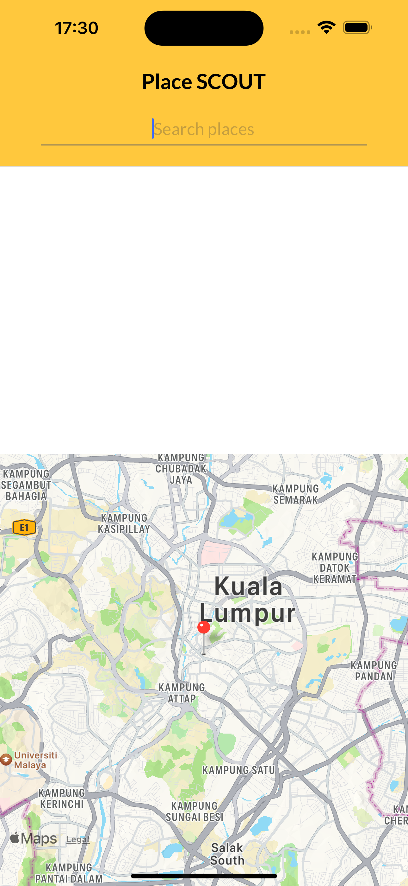

# Place SCOUT

## Overview

Place SCOUT is a single-page React Native application designed to utilize Google Place Autocomplete for finding places and displaying them on a map. The application is built with a focus on scalability, maintainability, and performance.

## Key Features

- **Google Place Autocomplete Integration**: Leverages [Google Map Web Services](https://developers.google.com/maps/documentation/places/web-service/autocomplete) for autocomplete functionality.
- **State Management with Redux**: Utilizes Redux for efficient and predictable state management.
- **Handling Side Effects with Redux Observable Epics**: Manages complex asynchronous operations using Redux Observable Epics.
- **Ant Design for UI**: Implements Ant Design components with Maybank theme, including custom colors and Leto font.
- **Scalable Codebase**: Follows a well-structured folder hierarchy to ensure code scalability and maintainability.
- **Type Safety with TypeScript**: Employs TypeScript to enhance type safety and reduce runtime errors.
- **Higher-Order Components**: Uses HOCs for error handling, logging, and other cross-cutting concerns.
- **Automated Testing**: Includes comprehensive test cases to ensure code reliability and robustness.

## Technology Stack

- **React Native**: Framework for building native mobile applications using React.
- **Google Map Web Services**: API for place autocomplete and other map-related functionalities.
- **Redux**: State management library for JavaScript applications.
- **Redux Observable**: Middleware for handling asynchronous actions in Redux.
- **Ant Design**: UI framework with a set of high-quality React components.
- **TypeScript**: Superset of JavaScript that adds static types.
- **Jest**: JavaScript testing framework for writing and running tests.

## Development Practices

- **Scalable Architecture**: Designed with a modular architecture to support scalability and maintainability.
- **Consistent Theming**: Adopts Maybank's theme, including them colors and fonts (Leto), for a consistent look and feel.
- **Error Handling and Logging**: Integrates HOCs to manage error handling and logging efficiently.
- **Automated Testing**: Ensures code quality and reliability through extensive test coverage.

## DEMO

[To view app in EXPO Go](https://expo.dev/preview/update?message=Place%20SCOUT&updateRuntimeVersion=1.0.0&createdAt=2024-07-29T09:45:47.233Z&slug=exp&projectId=bd5b718c-7755-4a84-aafb-0f9a394ddd97&group=731bccc7-3381-41bc-ad99-90e4aabc52b0)

## Screenshots

    
    
    
    

